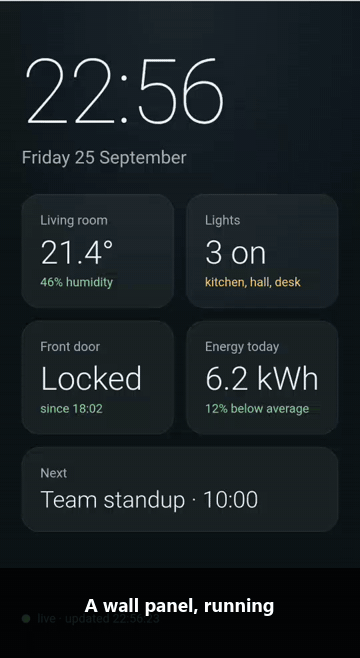
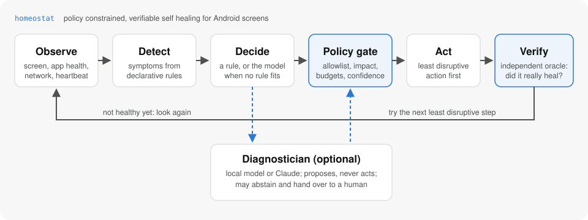
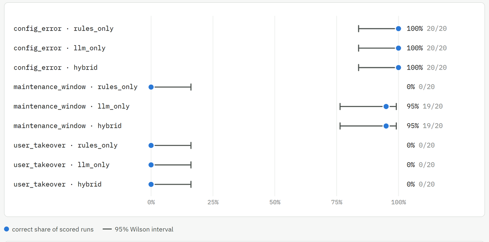

<h1 align="center">homeostat</h1>

<p align="center"><b>Turn an old Android phone into a screen that heals itself.</b></p>

<p align="center">
  <a href="LICENSE"></a>
  
  
  
  
</p>

<p align="center"><a href="https://emrehangorgec.github.io/homeostat/"><b>Project site and reports</b></a></p>

<p align="center">
  
</p>

Wall panels, menu boards, status displays: screens that should just work, all day, every
day. In practice they break quietly. The app crashes, a dialog covers the screen, the page
stays white, the session expires, Wi-Fi drops, and nobody notices until someone walks past.

**homeostat notices, fixes it with the least disruptive step the evidence justifies, and
then checks that the screen really healed.** It runs on plain rules, no AI and no API key
needed. An optional model helps with the cases rules cannot settle, and it is never
allowed to act on its own authority.

## How it works

<p align="center"></p>

- **Observe** a normalized snapshot of the device: what is on screen, whether the app is
  alive and says it is healthy, network, battery. A value that cannot be read stays
  unknown and is never guessed.
- **Decide** with declarative rules written as data. When no rule fits, an optional
  diagnostician (a local model or Claude) proposes a diagnosis, or says it is not sure.
- **Policy gate:** every proposal, from a rule or a model, passes the same checks. Only
  catalog actions, least disruptive first, budgets and cooldowns, confidence bars for
  models, never an irreversible action on a model's word alone.
- **Verify** with evidence the detector does not use: the app's UI marker, a screenshot
  that must not be blank, a stable process, a live heartbeat. "The command returned OK"
  is never counted as "fixed".

## Results on a real phone

Every number below comes from a OnePlus 5T running Android 10, 20 runs per scenario,
reported with 95% confidence intervals. Failures stay in the data.

**Rules alone handle the faults they were designed for: 240 of 240.**

| fault family | scenarios | correct |
| --- | --- | --- |
| app and window: crash, repeated crash under Android's dialog, wrong app in front, screen off | 4 | 80 / 80 |
| content and network: page never loads, backend down, session expired, script error, app hung, blank screen, Wi-Fi off, crash during an outage | 8 | 160 / 160 |

Zero unneeded disruptive actions. When the backend is down, the guardian waits and
reloads; it never restarts the app, because that cannot fix a backend.

**Where rules run out, a small local model helps, and shows its limits.** Three
situations were designed so that no rule can get them right: a page announcing planned
maintenance (right answer: wait), a page saying it is not configured (right answer: tell a
human, touch nothing), and a person picking up the phone to use another app (right answer:
leave them alone).

<p align="center"></p>

- With a free 4B model running on the laptop's GPU, correct outcomes go from **33% to 65%**.
- The model reads the maintenance notice and waits; rules can only escalate.
- On the user takeover it fails every time, and says it is **94% sure** each time. For this
  model, confidence carries no information, which is exactly why the policy never lets a
  model act on confidence alone.

Full reports with every run and step by step incidents, on the project site:
**[rules only, 240 runs](https://emrehangorgec.github.io/homeostat/reports/m1-device-02.html)** and
**[rules vs model, 180 runs](https://emrehangorgec.github.io/homeostat/reports/m3-device-qwen4b.html)**.

## What the real phone taught us

The simulator passed everything. The phone did not. Some of what it taught:

- **Android refuses to force stop a Device Owner app, silently.** `am force-stop` returns
  success and the hung app keeps running. SELinux blocks `run-as kill` too. A hung kiosk can
  only be restarted from inside the app, which is why homeostat's restart goes through the
  app's own main process.
- **A frozen app passes a naive health check.** Process up, in front, last frame on screen,
  even a cached UI tree. Only a heartbeat the app must keep publishing tells the difference.
- **The old page keeps talking during a reload.** While a new page load hung, the previous
  page kept reporting "ready" and hid the fault completely.
- **Android covers a crashing app with its own dialog.** Relaunching is not enough; the
  "app keeps stopping" dialog has to be dismissed first.
- **The lock screen comes back after sleep**, and the app is healthy behind it.
- **OxygenOS silences background apps after a minute**, so a quiet heartbeat only means
  "hung" while the app is on screen.
- **A blank page is not one exact color** (a system bar band differs by a few shades), and a
  single lost ping is not an outage.

Each of these became a signal, a rule or a fix, with a test.

## Try it without a phone

```
python -m venv .venv
.venv/Scripts/pip install -e ".[dev]"        # .venv/bin/pip on Linux and macOS
.venv/Scripts/homeostat demo -n 20 --seed 1
```

This runs every fault scenario against a built-in simulator and prints the results
table. Simulator numbers exercise the code; they are labelled as such and never reported as
device results.

<details>
<summary><b>With a phone</b></summary>

You need `adb` and a phone with USB debugging on. For the full set of recovery actions, the
homeostat agent is installed as Device Owner (see [android/README.md](android/README.md)).

```
cp config/homeostat.example.toml homeostat.toml   # target app and health marker
homeostat observe                                 # what the guardian sees right now
homeostat run                                     # guard the device
homeostat backend --reverse                       # test backend for content faults
homeostat eval app_crash backend_down -n 20       # measure recovery
homeostat report <experiment>                     # HTML report from the stored runs
```

Arms for the AI comparison: `--arm rules_only | hybrid | llm_only`. For a free local
diagnostician, install [Ollama](https://ollama.com), `ollama pull qwen3:4b`, and pass
`--provider ollama --model qwen3:4b`. Claude is supported with `--provider claude`
(credentials from `ANTHROPIC_API_KEY` or `ant auth login`).
</details>

<details>
<summary><b>Fault scenarios</b></summary>

| id | category | what happens |
| --- | --- | --- |
| `app_crash` | known | the app crashes |
| `app_killed` | variant | the app is force stopped, no crash log |
| `repeated_crash` | variant | two quick crashes; Android covers the app with its crash dialog |
| `wrong_foreground` | known | another app covers the target |
| `screen_off` | known | the display sleeps |
| `crash_then_screen_off` | composite | both at once |
| `crash_loop` | variant | the app crashes on every start |
| `blank_ui` | known | the content disappears while the app believes it is fine |
| `stuck_loading` | known | the page request hangs, content never finishes loading |
| `backend_down` | known | the backend answers 503 for 30 s: wait, do not restart |
| `auth_expired` | known | the backend invalidates sessions, the page gets 401 |
| `page_script_error` | known | the page is served with a script that throws |
| `app_hang` | variant | the main thread blocks: alive, in front, silent |
| `wifi_off` | known | Wi-Fi is switched off |
| `crash_during_outage` | composite | the app crashes while the backend is down |
| `maintenance_window` | variant | the page announces planned maintenance: wait |
| `config_error` | variant | the page says it is not configured: escalate, touch nothing |
| `user_takeover` | variant | a person opens another app and uses it: leave them alone |

Every fault states the lowest action impact that fixes it and the outcome a good guardian
reaches. A run is correct when it ends that way and nothing more disruptive was done.
</details>

<details>
<summary><b>Health contract</b></summary>

An app can tell homeostat how it is doing. The homeostat kiosk publishes one JSON line per
state change and every 5 s under the log tag `homeostat-health`:

```json
{"v":1,"state":"ready","detail":"","http":null,"age_ms":5021,"declared":true}
```

`state` is `loading`, `ready`, `error`, `auth_error` or `app_error`. A web page reports its
own state through the kiosk's JS bridge (`homeostat.declare(1)`, then
`homeostat.report(state, detail)`). Commands go the other way as package broadcasts:
`com.homeostat.contract.RELOAD`, `RESET_SESSION` and `RESTART`.
</details>

<details>
<summary><b>Writing rules</b></summary>

```toml
schema_version = "1"

[[rule]]
id = "app_not_running"
incident = "app_crash"
action = "relaunch_target"
alternatives = ["restart_target"]
priority = 30
when = [
    { path = "target_process.running", op = "eq", value = false },
    { path = "screen.awake", op = "ne", value = false },
]
```

Rules are data, so packs can be shared, and they are bound to a `DeviceState` schema
version; a pack for another version is refused at load time. Built-in rules:
[homeostat/detect/default_rules.toml](homeostat/detect/default_rules.toml).
</details>

<details>
<summary><b>Project layout</b></summary>

```
homeostat/
  state/      DeviceState schema, parsers, collector
  detect/     symptom and rule engine, built-in rule pack
  diagnose/   diagnostician contract, Claude and Ollama providers
  policy/     deterministic action gate
  act/        action catalog and executor
  verify/     healthy-state oracle
  guardian/   the recovery loop
  store/      SQLite persistence
  faults/     fault injection scenarios
  testbed/    backend that serves the kiosk page and injects server faults
  eval/       experiment runner and reports
  device/     adb transport and simulator
android/      on-device agent: Device Owner, web kiosk, health contract
```
</details>

## Roadmap

- [x] Device Owner on real hardware
- [x] Deterministic loop with an independent verifier
- [x] Content, backend and network faults, rules only baseline (240 / 240)
- [x] Diagnostician layer, local model measured against rules (180 runs)
- [ ] A stronger model, and asking the model when evidence contradicts a rule
- [ ] Rules learned from resolved incidents; evaluation on scenarios nobody tuned for
- [ ] The guardian on the phone itself, first release
- [ ] Linux kiosks (Raspberry Pi with Chromium)

## Contributing

Device reports, captured shell output from other Android versions, rule packs and fault
scenarios are especially welcome. See [CONTRIBUTING.md](CONTRIBUTING.md).

## License

[Apache License 2.0](LICENSE)
